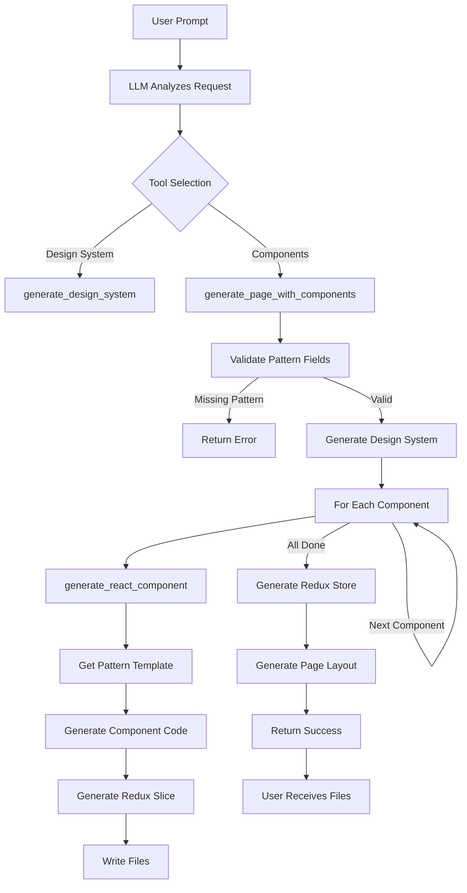

# Technical Documentation - AI Code Editor

## System Architecture

### High-Level Overview

The AI Code Editor is a Python-based AI agent system that generates production-ready React applications. The system uses Groq's LLM API to intelligently coordinate code generation tools based on natural language requests.

```
┌──────────────────────────────────────────────────────────────┐
│                        USER INTERFACE                         │
│  (CLI / API / Future: VS Code Extension)                     │
└────────────────────┬─────────────────────────────────────────┘
                     │
                     ▼
┌──────────────────────────────────────────────────────────────┐
│                       AGENT CORE                              │
│  • LLM Orchestration (Groq API)                              │
│  • Tool Selection & Execution                                 │
│  • Context Management                                         │
│  • Error Handling & Recovery                                  │
└────────────────────┬─────────────────────────────────────────┘
                     │
         ┌───────────┴───────────┐
         ▼                       ▼
┌─────────────────┐     ┌─────────────────┐
│  TOOL REGISTRY  │     │ MEMORY MANAGER  │
│  • File Ops     │     │  • Short-term   │
│  • JS Tools     │     │  • Long-term    │
│  • Page Mgmt    │     │  • Vector DB    │
│  • Design Sys   │     │                 │
└─────────────────┘     └─────────────────┘
         │                       │
         └───────────┬───────────┘
                     ▼
        ┌──────────────────────┐
        │   OUTPUT DIRECTORY   │
        │  • React Components  │
        │  • Redux Slices      │
        │  • Design System     │
        │  • Next.js Pages     │
        └──────────────────────┘
```

## Core Components

### 1. Agent Core (`src/agent_core.py`)

**Responsibilities**:
- Orchestrate LLM calls to Groq API
- Parse tool calls from LLM responses
- Execute tools and handle results
- Manage conversation context
- Error recovery and retry logic

**Key Functions**:

```python
async def run_agent(
    prompt: str,
    max_iterations: int = 10,
    output_dir: str = "./demo"
) -> AgentResult:
    """
    Main agent loop that processes user prompts and executes tools.
    
    Args:
        prompt: Natural language request from user
        max_iterations: Maximum tool execution iterations
        output_dir: Directory for generated files
    
    Returns:
        AgentResult with success status and generated files
    """
    context = initialize_context()
    
    for i in range(max_iterations):
        # Get LLM response with tool calls
        response = await groq_client.chat.completions.create(
            model="llama-3.1-8b-instant",
            messages=context.messages,
            tools=get_tool_schemas(),
            tool_choice="auto"
        )
        
        # Execute tool calls
        if response.tool_calls:
            for tool_call in response.tool_calls:
                result = await execute_tool(tool_call, output_dir)
                context.add_tool_result(result)
        else:
            # No more tool calls, agent finished
            break
    
    return AgentResult(
        success=True,
        files_created=context.files_created,
        message=response.content
    )
```

**LLM Prompting Strategy**:

```python
SYSTEM_PROMPT = """
You are an expert React developer AI assistant. You can:

1. Generate design systems with Tailwind config
2. Create React components with TypeScript
3. Build pages with multiple components
4. Set up Redux state management

CRITICAL PATTERN RULES:
- sidebar: Navigation panels, menu lists
- header: Top bars with logo/search/user
- footer: Bottom bars with links/copyright
- messages: Chat bubbles, comment threads
- input: Message/comment entry fields
- card: Content blocks, product displays
- button: CTAs, form submissions
- form: User input, data collection
- modal: Dialogs, overlays
- list: Repeating items, menus
- hero: Landing page headers
- feature: Product highlights
- pricing: Subscription tiers

WRONG ❌ vs RIGHT ✅ Examples:

❌ WRONG: ChatSidebar with pattern='card'
✅ RIGHT: ChatSidebar with pattern='sidebar'

❌ WRONG: ChatHeader with pattern='card'
✅ RIGHT: ChatHeader with pattern='header'

❌ WRONG: ChatMessageList with pattern='list'
✅ RIGHT: ChatMessageList with pattern='messages'

Pattern is MANDATORY - generation will fail if missing!
"""
```

**Guidelines System Integration**:

```python
def build_tool_description(tool_info: dict) -> str:
    """Build tool description with guidelines for LLM."""
    desc = f"{tool_info['description']}\n"
    
    # Add guidelines if present
    if "guidelines" in tool_info:
        desc += "\n📋 CRITICAL GUIDELINES:\n"
        for category, rules in tool_info["guidelines"].items():
            desc += f"\n{category.upper()}:\n"
            if isinstance(rules, dict):
                for key, value in rules.items():
                    desc += f"  • {key}: {value}\n"
            else:
                desc += f"  {rules}\n"
    
    return desc
```

### 2. Tool System (`src/tools/`)

#### File Operations (`file_operations.py`)
```python
async def write_file(path: str, content: str) -> ToolResult:
    """Write content to file, creating directories if needed."""
    os.makedirs(os.path.dirname(path), exist_ok=True)
    with open(path, 'w', encoding='utf-8') as f:
        f.write(content)
    return ToolResult(success=True, file_path=path)

async def read_file(path: str) -> ToolResult:
    """Read file content."""
    with open(path, 'r', encoding='utf-8') as f:
        content = f.read()
    return ToolResult(success=True, content=content)
```

#### JavaScript Tools (`javascript_tools.py`)

**Core Functions**:
- `generate_react_component()` - Creates React component with pattern template
- `generate_redux_slice()` - Creates Redux Toolkit slice
- `generate_redux_store()` - Creates store configuration with hooks

**Pattern Templates** (13 patterns):

```python
def _get_component_pattern_code(
    name: str,
    pattern: str,
    styling: str,
    props: Dict[str, Any]
) -> str:
    """
    Generate component code based on pattern.
    
    Args:
        name: Component name (e.g., 'ChatSidebar')
        pattern: One of 13 patterns (sidebar, header, footer, messages, input, etc.)
        styling: 'tailwind' or 'css-modules'
        props: Component props definition
    
    Returns:
        Complete React component code
    """
    
    if pattern == 'sidebar':
        # Navigation panel with menu items and user profile
        component_code = f"const {name} = ({{ items, userInfo }}) => {{\n"
        component_code += "  return (\n"
        component_code += "    <aside className='h-full bg-gray-900 text-white flex flex-col'>\n"
        component_code += "      <div className='p-4 border-b border-gray-800'>\n"
        component_code += "        <h2 className='text-xl font-bold'>App Name</h2>\n"
        component_code += "      </div>\n"
        component_code += "      <nav className='flex-1 overflow-y-auto'>\n"
        component_code += "        {items.map((item, idx) => (\n"
        component_code += "          <a key={idx} href={item.href} className='flex items-center px-4 py-3 hover:bg-gray-800'>\n"
        component_code += "            <span className='mr-3'>{item.icon}</span>\n"
        component_code += "            <span>{item.label}</span>\n"
        component_code += "          </a>\n"
        component_code += "        ))}\n"
        component_code += "      </nav>\n"
        component_code += "      <div className='p-4 border-t border-gray-800'>\n"
        component_code += "        <div className='flex items-center'>\n"
        component_code += "          \n"
        component_code += "          <div className='ml-3'>\n"
        component_code += "            <p className='font-medium'>{userInfo.name}</p>\n"
        component_code += "            <p className='text-sm text-gray-400'>{userInfo.email}</p>\n"
        component_code += "          </div>\n"
        component_code += "        </div>\n"
        component_code += "      </div>\n"
        component_code += "    </aside>\n"
        component_code += "  );\n"
        component_code += "};\n"
        
    elif pattern == 'header':
        # Top bar with logo, search, notifications, user avatar
        component_code = f"const {name} = ({{ title, onMenuClick, userAvatar }}) => {{\n"
        component_code += "  return (\n"
        component_code += "    <header className='bg-white border-b border-gray-200 px-4 py-3'>\n"
        component_code += "      <div className='flex items-center justify-between'>\n"
        component_code += "        <div className='flex items-center'>\n"
        component_code += "          <button onClick={onMenuClick} className='md:hidden mr-4'>☰</button>\n"
        component_code += "          <h1 className='text-xl font-bold'>{title}</h1>\n"
        component_code += "        </div>\n"
        component_code += "        <div className='flex items-center gap-4'>\n"
        component_code += "          <input type='search' placeholder='Search...' className='hidden md:block px-4 py-2 rounded-lg border border-gray-300' />\n"
        component_code += "          <button className='relative'>\n"
        component_code += "            <span>🔔</span>\n"
        component_code += "            <span className='absolute -top-1 -right-1 bg-red-500 text-white text-xs rounded-full w-4 h-4 flex items-center justify-center'>3</span>\n"
        component_code += "          </button>\n"
        component_code += "          \n"
        component_code += "        </div>\n"
        component_code += "      </div>\n"
        component_code += "    </header>\n"
        component_code += "  );\n"
        component_code += "};\n"
    
    # ... (11 more patterns: footer, messages, input, card, button, form, modal, list, hero, feature, pricing)
    
    return component_code
```

**CRITICAL FIX - Double Brace Bug**:

```python
# ❌ WRONG (old code - caused {{ in output)
code = f"""
const {name} = () => {{{{
  return <div className={{{{styles.container}}}}>
    {{{{children}}}}
  </div>
}}}}
"""

# ✅ CORRECT (new code - proper escaping)
code = f"const {name} = () => {{\n"
code += "  return <div className={styles.container}>\n"
code += "    {children}\n"
code += "  </div>\n"
code += "};\n"
```

#### Page Management (`page_management.py`)

**Core Function**:

```python
async def generate_page_with_components(
    page_name: str,
    components: List[Dict[str, Any]],
    layout_type: str = "grid",
    output_dir: str = "./demo",
    design_config_path: Optional[str] = None
) -> ToolResult:
    """
    Generate a complete page with multiple components.
    
    Args:
        page_name: Name of the page (e.g., 'ChatInterface')
        components: List of component specs:
            [{
                'name': 'ChatSidebar',
                'pattern': 'sidebar',  # REQUIRED!
                'variant': 'primary',
                'props': {...}
            }, ...]
        layout_type: 'chat' | 'dashboard' | 'landing' | 'grid' | 'app'
        output_dir: Output directory
        design_config_path: Path to design system config
    
    Returns:
        ToolResult with created files
    """
    
    # 1. Validate all components have pattern field
    for comp_spec in components:
        comp_name = comp_spec.get('name', 'Unnamed')
        
        # ❌ OLD CODE (had fallback):
        # component_pattern = comp_spec.get('pattern', 'card')
        
        # ✅ NEW CODE (pattern is REQUIRED):
        if 'pattern' not in comp_spec:
            return ToolResult(
                success=False,
                error=f"Component '{comp_name}' missing REQUIRED 'pattern' field. "
                      f"Pattern must be one of: sidebar, header, footer, messages, input, "
                      f"card, button, form, modal, list, hero, feature, pricing. "
                      f"Do NOT default to 'card' - choose semantic pattern!"
            )
        
        component_pattern = comp_spec['pattern']
    
    # 2. Generate design system (if config provided)
    if design_config_path:
        design_result = await generate_design_system(design_config_path, output_dir)
    
    # 3. Generate each component
    created_files = []
    for comp_spec in components:
        component_result = await generate_react_component(
            name=comp_spec['name'],
            component_pattern=comp_spec['pattern'],
            styling='tailwind',
            output_dir=output_dir,
            include_redux=True
        )
        created_files.extend(component_result.files_created)
    
    # 4. Generate Redux store
    store_result = await generate_redux_store(
        components=[c['name'] for c in components],
        output_dir=output_dir
    )
    created_files.extend(store_result.files_created)
    
    # 5. Generate page with layout
    page_code = _generate_page_code(page_name, components, layout_type)
    page_path = f"{output_dir}/src/app/{page_name.lower()}/page.tsx"
    await write_file(page_path, page_code)
    created_files.append(page_path)
    
    return ToolResult(
        success=True,
        files_created=created_files,
        message=f"Generated {page_name} with {len(components)} components using {layout_type} layout"
    )
```

**Layout Generation**:

```python
def _generate_page_code(
    page_name: str,
    components: List[Dict],
    layout_type: str
) -> str:
    """Generate page code with appropriate layout."""
    
    imports = "\n".join([
        f"import {c['name']} from '@/components/{c['name']}';"
        for c in components
    ])
    
    if layout_type == 'chat':
        # Chat layout: sidebar + header + messages + input + footer
        layout = """
        <div className="flex h-screen">
          <aside className="hidden md:flex md:w-64">
            <ChatSidebar items={sidebarItems} userInfo={userInfo} />
          </aside>
          <div className="flex-1 flex flex-col">
            <header>
              <ChatHeader title="Chat" onMenuClick={toggleMenu} userAvatar="/avatar.png" />
            </header>
            <main className="flex-1 overflow-y-auto p-4">
              <ChatMessageList messages={messages} />
            </main>
            <div>
              <ChatInput value={input} onChange={setInput} onSubmit={handleSend} placeholder="Type a message..." />
            </div>
            <footer>
              <ChatFooter links={footerLinks} copyright="© 2025 App Name" />
            </footer>
          </div>
        </div>
        """
    
    elif layout_type == 'dashboard':
        # Dashboard layout: sidebar + header + grid
        layout = """
        <div className="flex">
          <aside className="w-64">
            <DashboardSidebar items={menuItems} userInfo={userInfo} />
          </aside>
          <div className="flex-1">
            <header>
              <DashboardHeader title="Dashboard" />
            </header>
            <main className="p-6">
              <div className="grid grid-cols-1 lg:grid-cols-2 xl:grid-cols-3 gap-6">
                {widgets.map(widget => <Card key={widget.id} {...widget} />)}
              </div>
            </main>
          </div>
        </div>
        """
    
    # ... (3 more layouts: landing, grid, app)
    
    return f"""
    'use client';
    
    import React from 'react';
    {imports}
    
    export default function {page_name}() {{
      // Component logic here
      
      return (
        {layout}
      );
    }}
    """
```

#### Design System Tools (`design_system.py`, `design_tokens.py`)

```python
async def generate_design_system(
    config_path: str,
    output_dir: str = "./demo"
) -> ToolResult:
    """
    Generate complete design system from JSON config.
    
    Creates:
    - globals.css with design tokens
    - tailwind.config.js with theme
    - README.md with usage instructions
    """
    
    # 1. Load configuration
    with open(config_path, 'r') as f:
        config = json.load(f)
    
    # 2. Generate globals.css
    css_content = _generate_globals_css(config['tokens'])
    await write_file(f"{output_dir}/src/app/globals.css", css_content)
    
    # 3. Generate tailwind.config.js
    tailwind_config = _generate_tailwind_config(config['tokens'])
    await write_file(f"{output_dir}/tailwind.config.js", tailwind_config)
    
    # 4. Generate Next.js config
    next_config = _generate_next_config()
    await write_file(f"{output_dir}/next.config.js", next_config)
    
    # 5. Generate package.json
    package_json = _generate_package_json(config['name'])
    await write_file(f"{output_dir}/package.json", package_json)
    
    # 6. Generate TypeScript config
    ts_config = _generate_typescript_config()
    await write_file(f"{output_dir}/tsconfig.json", ts_config)
    
    return ToolResult(
        success=True,
        files_created=[
            "globals.css", "tailwind.config.js", "next.config.js",
            "package.json", "tsconfig.json"
        ]
    )
```

**Design Token Generation**:

```python
def _generate_globals_css(tokens: Dict) -> str:
    """Generate globals.css with CSS custom properties."""
    
    css = "@tailwind base;\n@tailwind components;\n@tailwind utilities;\n\n"
    css += ":root {\n"
    
    # Color tokens
    for color_name, shades in tokens['colors'].items():
        if isinstance(shades, dict):
            for shade, value in shades.items():
                css += f"  --color-{color_name}-{shade}: {value};\n"
        else:
            css += f"  --color-{color_name}: {shades};\n"
    
    # Typography tokens
    for size, value in tokens['typography']['fontSize'].items():
        css += f"  --font-size-{size}: {value};\n"
    
    # Spacing tokens
    for size, value in tokens['spacing'].items():
        css += f"  --spacing-{size}: {value};\n"
    
    css += "}\n"
    
    return css
```

```python
def _generate_tailwind_config(tokens: Dict) -> str:
    """Generate tailwind.config.js with theme extensions."""
    
    config = {
        "content": [
            "./src/**/*.{js,ts,jsx,tsx,mdx}"
        ],
        "theme": {
            "extend": {
                "colors": tokens['colors'],
                "fontSize": tokens['typography']['fontSize'],
                "spacing": tokens['spacing'],
                "borderRadius": tokens.get('borderRadius', {}),
                "boxShadow": tokens.get('shadows', {})
            }
        },
        "plugins": []
    }
    
    return f"module.exports = {json.dumps(config, indent=2)}"
```

### 3. Configuration (`config.py`, `tool_dictionary.json`)

**Tool Schema Registration**:

```python
# tool_dictionary.json
{
  "generate_react_component": {
    "name": "generate_react_component",
    "description": "Generate a React component with specified pattern",
    "parameters": {
      "type": "object",
      "properties": {
        "name": {
          "type": "string",
          "description": "Component name in PascalCase (e.g., ChatSidebar)"
        },
        "component_pattern": {
          "type": "string",
          "enum": ["sidebar", "header", "footer", "messages", "input", "card", "button", "form", "modal", "list", "hero", "feature", "pricing"],
          "description": "Semantic pattern - CHOOSE CAREFULLY!"
        },
        "styling": {
          "type": "string",
          "enum": ["tailwind", "css-modules"],
          "default": "tailwind"
        },
        "include_redux": {
          "type": "boolean",
          "default": false
        }
      },
      "required": ["name", "component_pattern"]
    },
    "guidelines": {
      "pattern_selection": {
        "sidebar": "Navigation panels, menu lists, app navigation",
        "header": "Top bars with logo, search, notifications, user avatar",
        "footer": "Bottom bars with links, copyright, social icons",
        "messages": "Chat bubbles, comment threads (alternating left/right)",
        "input": "Message entry, comment forms, inline inputs with actions",
        "card": "Content blocks, product displays, info panels (NOT for navigation!)",
        "button": "CTAs, form submissions, actions",
        "form": "Data collection, settings, multi-field inputs",
        "modal": "Dialogs, confirmations, overlay content",
        "list": "Repeating items, menu lists, data tables",
        "hero": "Landing page headers, product intros",
        "feature": "Product highlights, service features",
        "pricing": "Subscription tiers, product pricing tables"
      },
      "naming_convention": "PascalCase (e.g., ChatSidebar, UserProfile, SettingsForm)",
      "responsive_requirements": "All patterns must use Tailwind breakpoints (sm:, md:, lg:, xl:) for mobile-first responsive design",
      "common_mistakes": {
        "wrong_1": "Using 'card' for ChatSidebar → Use 'sidebar'",
        "wrong_2": "Using 'list' for ChatMessageList → Use 'messages'",
        "wrong_3": "Using 'form' for message input → Use 'input'",
        "wrong_4": "Defaulting to 'card' when unsure → REQUIRED field, choose semantic pattern!"
      }
    }
  },
  
  "generate_page_with_components": {
    "name": "generate_page_with_components",
    "description": "Generate a complete page with multiple components and layout",
    "parameters": {
      "type": "object",
      "properties": {
        "page_name": {
          "type": "string",
          "description": "Page name in PascalCase (e.g., ChatInterface, Dashboard)"
        },
        "components": {
          "type": "array",
          "items": {
            "type": "object",
            "properties": {
              "name": { "type": "string" },
              "pattern": { "type": "string" },  // REQUIRED!
              "variant": { "type": "string" },
              "props": { "type": "object" }
            },
            "required": ["name", "pattern"]
          },
          "description": "Array of component specifications - PATTERN IS MANDATORY!"
        },
        "layout_type": {
          "type": "string",
          "enum": ["chat", "dashboard", "landing", "grid", "app"],
          "default": "grid"
        }
      },
      "required": ["page_name", "components"]
    },
    "guidelines": {
      "pattern_is_mandatory": "CRITICAL: Every component MUST have a 'pattern' field. Generation will FAIL if missing. Do NOT default to 'card'.",
      "pattern_selection_by_layout": {
        "chat": "Use sidebar, header, messages, input, footer patterns",
        "dashboard": "Use sidebar, header, card (for widgets), list, form patterns",
        "landing": "Use hero, feature, pricing, footer patterns",
        "grid": "Use card pattern for grid items",
        "app": "Mix patterns as needed for complex layouts"
      },
      "component_examples": {
        "correct_chat": "ChatInterface with ChatSidebar (pattern='sidebar'), ChatHeader (pattern='header'), ChatMessageList (pattern='messages'), ChatInput (pattern='input'), ChatFooter (pattern='footer')",
        "wrong_chat": "ChatInterface with all components using pattern='card' → WRONG! Use semantic patterns!",
        "correct_dashboard": "Dashboard with DashboardSidebar (pattern='sidebar'), DashboardHeader (pattern='header'), widgets (pattern='card')",
        "wrong_dashboard": "Dashboard with DashboardSidebar (pattern='card') → WRONG! Sidebar is NOT a card!"
      },
      "layout_component_mapping": {
        "chat_layout_needs": "sidebar, header, messages, input, footer",
        "dashboard_layout_needs": "sidebar, header, cards/lists for content",
        "landing_layout_needs": "hero, feature, pricing, footer",
        "grid_layout_needs": "cards",
        "app_layout_needs": "flexible - choose semantic patterns for each section"
      }
    }
  }
}
```

### 4. Memory Manager (`memory_manager.py`)

**Context Management**:

```python
class ContextManager:
    """Manages conversation context and file state."""
    
    def __init__(self, max_context_length: int = 10):
        self.messages: List[Dict] = []
        self.files_created: List[str] = []
        self.max_context_length = max_context_length
    
    def add_user_message(self, content: str):
        """Add user message to context."""
        self.messages.append({
            "role": "user",
            "content": content
        })
        self._trim_context()
    
    def add_assistant_message(self, content: str, tool_calls: Optional[List] = None):
        """Add assistant message to context."""
        msg = {"role": "assistant", "content": content}
        if tool_calls:
            msg["tool_calls"] = tool_calls
        self.messages.append(msg)
        self._trim_context()
    
    def add_tool_result(self, tool_call_id: str, result: ToolResult):
        """Add tool execution result to context."""
        self.messages.append({
            "role": "tool",
            "tool_call_id": tool_call_id,
            "content": json.dumps({
                "success": result.success,
                "files_created": result.files_created,
                "error": result.error
            })
        })
        if result.files_created:
            self.files_created.extend(result.files_created)
        self._trim_context()
    
    def _trim_context(self):
        """Keep only recent messages to stay within token limits."""
        if len(self.messages) > self.max_context_length:
            # Keep system message + recent messages
            self.messages = [self.messages[0]] + self.messages[-self.max_context_length:]
```

### 5. API Server (`api_server.py`)

**FastAPI Endpoints**:

```python
from fastapi import FastAPI, HTTPException
from pydantic import BaseModel
import asyncio

app = FastAPI(
    title="AI Code Editor API",
    version="1.0.0",
    description="Generate React applications with AI"
)

class GenerateRequest(BaseModel):
    prompt: str
    output_dir: str = "./demo"
    max_iterations: int = 10

class GenerateResponse(BaseModel):
    success: bool
    files_created: List[str]
    message: str
    error: Optional[str] = None

@app.post("/generate", response_model=GenerateResponse)
async def generate_code(request: GenerateRequest):
    """Generate code from natural language prompt."""
    try:
        result = await run_agent(
            prompt=request.prompt,
            max_iterations=request.max_iterations,
            output_dir=request.output_dir
        )
        return GenerateResponse(
            success=result.success,
            files_created=result.files_created,
            message=result.message
        )
    except Exception as e:
        raise HTTPException(status_code=500, detail=str(e))

@app.get("/health")
async def health_check():
    """Health check endpoint."""
    return {"status": "healthy", "version": "1.0.0"}

@app.get("/tools")
async def list_tools():
    """List available tools."""
    return {
        "tools": [
            {"name": "generate_react_component", "description": "..."},
            {"name": "generate_page_with_components", "description": "..."},
            {"name": "generate_design_system", "description": "..."},
            {"name": "generate_redux_slice", "description": "..."},
            {"name": "generate_redux_store", "description": "..."}
        ]
    }

if __name__ == "__main__":
    import uvicorn
    uvicorn.run(app, host="0.0.0.0", port=8000)
```

## Technology Stack

### Core Framework
- **Python 3.9+**: Modern async/await, type hints, dataclasses
- **Pydantic v2**: Schema validation, type safety
- **FastAPI**: High-performance async web framework
- **asyncio**: Concurrent tool execution

### LLM Integration
- **Groq API**: Ultra-fast LLM inference (llama-3.1-8b-instant)
- **Tool Calling**: Native function calling support
- **Token Optimization**: Context trimming, efficient prompts

### Frontend Generation
- **Next.js 14**: React framework with App Router
- **TypeScript**: Type-safe React components
- **Tailwind CSS 3**: Utility-first styling
- **Redux Toolkit 2**: State management
- **React 18**: Latest React features (hooks, suspense)

### Development
- **pytest**: Unit and E2E testing
- **black**: Code formatting
- **mypy**: Static type checking
- **pylint**: Code linting

## Code Generation Pipeline

### Step-by-Step Flow



### Detailed Execution

```python
# Example: Generating a chat interface

# 1. User prompt
prompt = "Create a chat interface with sidebar, header, message list, input, and footer"

# 2. LLM decides to call generate_page_with_components
tool_call = {
    "function": "generate_page_with_components",
    "arguments": {
        "page_name": "ChatInterface",
        "components": [
            {"name": "ChatSidebar", "pattern": "sidebar", "variant": "primary"},
            {"name": "ChatHeader", "pattern": "header", "variant": "secondary"},
            {"name": "ChatMessageList", "pattern": "messages", "variant": "primary"},
            {"name": "ChatInput", "pattern": "input", "variant": "primary"},
            {"name": "ChatFooter", "pattern": "footer", "variant": "secondary"}
        ],
        "layout_type": "chat"
    }
}

# 3. Tool execution begins
result = await generate_page_with_components(**tool_call.arguments)

# 4. Pattern validation
for comp in components:
    if 'pattern' not in comp:
        raise ValueError(f"Component {comp['name']} missing required 'pattern' field!")

# 5. Design system generation (if config exists)
if os.path.exists('design-system.json'):
    await generate_design_system('design-system.json', output_dir)

# 6. Component generation loop
for comp in components:
    # 6a. Generate component code
    component_code = _get_component_pattern_code(
        name=comp['name'],
        pattern=comp['pattern'],  # sidebar, header, messages, input, footer
        styling='tailwind',
        props=comp.get('props', {})
    )
    
    # 6b. Write component file
    await write_file(f"{output_dir}/src/components/{comp['name']}.tsx", component_code)
    
    # 6c. Generate Redux slice
    slice_code = _generate_redux_slice(comp['name'])
    await write_file(f"{output_dir}/src/redux/{comp['name'].lower()}Slice.ts", slice_code)

# 7. Generate Redux store
store_code = _generate_redux_store([c['name'] for c in components])
await write_file(f"{output_dir}/src/redux/store.ts", store_code)
await write_file(f"{output_dir}/src/redux/hooks.ts", hooks_code)

# 8. Generate page with layout
page_code = _generate_page_code("ChatInterface", components, "chat")
await write_file(f"{output_dir}/src/app/chat/page.tsx", page_code)

# 9. Return result
return ToolResult(
    success=True,
    files_created=[
        'src/components/ChatSidebar.tsx',
        'src/components/ChatHeader.tsx',
        'src/components/ChatMessageList.tsx',
        'src/components/ChatInput.tsx',
        'src/components/ChatFooter.tsx',
        'src/redux/chatsidebarSlice.ts',
        'src/redux/chatheaderSlice.ts',
        'src/redux/chatmessagelistSlice.ts',
        'src/redux/chatinputSlice.ts',
        'src/redux/chatfooterSlice.ts',
        'src/redux/store.ts',
        'src/redux/hooks.ts',
        'src/app/chat/page.tsx'
    ],
    message="Generated ChatInterface with 5 components using chat layout"
)
```

## Testing Strategy

### Unit Tests (`tests/test_design_system.py`)

```python
import pytest
from src.tools.design_system import generate_design_system
from src.tools.javascript_tools import generate_react_component

@pytest.mark.asyncio
async def test_design_system_generation():
    """Test design system generation from config."""
    result = await generate_design_system(
        config_path="config/design-system.example.json",
        output_dir="./test_output"
    )
    
    assert result.success is True
    assert "globals.css" in result.files_created
    assert "tailwind.config.js" in result.files_created
    assert "package.json" in result.files_created

@pytest.mark.asyncio
async def test_component_generation_all_patterns():
    """Test all 13 component patterns."""
    patterns = [
        "sidebar", "header", "footer", "messages", "input",
        "card", "button", "form", "modal", "list",
        "hero", "feature", "pricing"
    ]
    
    for pattern in patterns:
        result = await generate_react_component(
            name=f"Test{pattern.capitalize()}",
            component_pattern=pattern,
            styling="tailwind",
            output_dir="./test_output"
        )
        
        assert result.success is True
        assert len(result.files_created) > 0
        
        # Read generated file
        component_path = result.files_created[0]
        with open(component_path, 'r') as f:
            code = f.read()
        
        # Verify no double braces (the bug we fixed!)
        assert "{{" not in code or "className={{" in code  # Allow object syntax
        assert "}}}}" not in code
        
        # Verify pattern-specific elements
        if pattern == "sidebar":
            assert "<aside" in code
            assert "nav" in code
        elif pattern == "header":
            assert "<header" in code
        elif pattern == "footer":
            assert "<footer" in code
        elif pattern == "messages":
            assert "flex" in code
            assert "justify-end" in code or "justify-start" in code

@pytest.mark.asyncio
async def test_pattern_required_validation():
    """Test that missing pattern field raises error."""
    from src.tools.page_management import generate_page_with_components
    
    result = await generate_page_with_components(
        page_name="TestPage",
        components=[
            {"name": "TestComponent"}  # Missing 'pattern' field!
        ],
        layout_type="grid",
        output_dir="./test_output"
    )
    
    assert result.success is False
    assert "missing REQUIRED 'pattern' field" in result.error
```

### E2E Tests (`tests/test_e2e_design_system.py`)

```python
@pytest.mark.asyncio
async def test_full_chat_interface_generation():
    """End-to-end test: Generate complete chat interface."""
    
    # 1. Generate design system
    design_result = await generate_design_system(
        config_path="config/design-system.example.json",
        output_dir="./e2e_test_output"
    )
    assert design_result.success is True
    
    # 2. Generate page with components
    page_result = await generate_page_with_components(
        page_name="ChatInterface",
        components=[
            {"name": "ChatSidebar", "pattern": "sidebar", "variant": "primary"},
            {"name": "ChatHeader", "pattern": "header", "variant": "secondary"},
            {"name": "ChatMessageList", "pattern": "messages", "variant": "primary"},
            {"name": "ChatInput", "pattern": "input", "variant": "primary"},
            {"name": "ChatFooter", "pattern": "footer", "variant": "secondary"}
        ],
        layout_type="chat",
        output_dir="./e2e_test_output"
    )
    assert page_result.success is True
    
    # 3. Verify generated files
    expected_files = [
        "src/components/ChatSidebar.tsx",
        "src/components/ChatHeader.tsx",
        "src/components/ChatMessageList.tsx",
        "src/components/ChatInput.tsx",
        "src/components/ChatFooter.tsx",
        "src/redux/store.ts",
        "src/app/chat/page.tsx"
    ]
    
    for file_path in expected_files:
        full_path = f"./e2e_test_output/{file_path}"
        assert os.path.exists(full_path), f"Expected file not found: {file_path}"
    
    # 4. Run npm install (verify package.json is valid)
    result = subprocess.run(
        ["npm", "install"],
        cwd="./e2e_test_output",
        capture_output=True
    )
    assert result.returncode == 0, f"npm install failed: {result.stderr}"
    
    # 5. Run npm build (verify code compiles)
    result = subprocess.run(
        ["npm", "run", "build"],
        cwd="./e2e_test_output",
        capture_output=True
    )
    assert result.returncode == 0, f"npm build failed: {result.stderr}"
```

## Deployment

### Local Development

```bash
# 1. Install dependencies
python -m venv venv
source venv/bin/activate  # On Windows: venv\Scripts\activate
pip install -r requirements.txt

# 2. Set environment variables
export GROQ_API_KEY="your-api-key"

# 3. Run agent directly
python -m src.agent_core "Create a chat interface"

# 4. Or start API server
python src/api_server.py
```

### Docker Deployment

```dockerfile
# Dockerfile
FROM python:3.11-slim

WORKDIR /app

# Install dependencies
COPY requirements.txt .
RUN pip install --no-cache-dir -r requirements.txt

# Copy source code
COPY src/ ./src/
COPY config/ ./config/

# Set environment variables
ENV GROQ_API_KEY=""
ENV OUTPUT_DIR="/app/output"

# Expose API port
EXPOSE 8000

# Run API server
CMD ["python", "src/api_server.py"]
```

```yaml
# docker-compose.yml
version: '3.8'

services:
  ai-code-editor:
    build: .
    ports:
      - "8000:8000"
    environment:
      - GROQ_API_KEY=${GROQ_API_KEY}
    volumes:
      - ./output:/app/output
```

### Kubernetes Deployment

```yaml
# k8s/deployment.yaml
apiVersion: apps/v1
kind: Deployment
metadata:
  name: ai-code-editor
spec:
  replicas: 3
  selector:
    matchLabels:
      app: ai-code-editor
  template:
    metadata:
      labels:
        app: ai-code-editor
    spec:
      containers:
      - name: api
        image: ai-code-editor:latest
        ports:
        - containerPort: 8000
        env:
        - name: GROQ_API_KEY
          valueFrom:
            secretKeyRef:
              name: groq-api-key
              key: api-key
        resources:
          requests:
            memory: "512Mi"
            cpu: "500m"
          limits:
            memory: "1Gi"
            cpu: "1000m"
---
apiVersion: v1
kind: Service
metadata:
  name: ai-code-editor
spec:
  selector:
    app: ai-code-editor
  ports:
  - protocol: TCP
    port: 80
    targetPort: 8000
  type: LoadBalancer
```

## Performance Optimization

### LLM Token Optimization

```python
# Trim context to stay within limits
MAX_CONTEXT_LENGTH = 10

def _trim_context(messages: List[Dict]) -> List[Dict]:
    """Keep only recent messages."""
    if len(messages) > MAX_CONTEXT_LENGTH:
        return [messages[0]] + messages[-MAX_CONTEXT_LENGTH:]
    return messages

# Compress tool results
def _compress_tool_result(result: ToolResult) -> str:
    """Return minimal tool result info."""
    return json.dumps({
        "success": result.success,
        "files_created": len(result.files_created),  # Count, not full list
        "error": result.error[:100] if result.error else None  # Truncate errors
    })
```

### Concurrent Tool Execution

```python
async def execute_tools_parallel(tool_calls: List[ToolCall]) -> List[ToolResult]:
    """Execute independent tool calls concurrently."""
    tasks = [execute_tool(tc) for tc in tool_calls]
    results = await asyncio.gather(*tasks, return_exceptions=True)
    return results
```

### Caching

```python
from functools import lru_cache

@lru_cache(maxsize=128)
def get_pattern_template(pattern: str) -> str:
    """Cache pattern templates."""
    return _load_pattern_template(pattern)
```

## Error Handling

### Validation Errors

```python
class PatternValidationError(Exception):
    """Raised when component pattern is invalid or missing."""
    pass

def validate_component_spec(spec: Dict) -> None:
    """Validate component specification."""
    if 'name' not in spec:
        raise ValueError("Component spec missing required 'name' field")
    
    if 'pattern' not in spec:
        raise PatternValidationError(
            f"Component '{spec['name']}' missing REQUIRED 'pattern' field. "
            f"Pattern must be one of: sidebar, header, footer, messages, input, "
            f"card, button, form, modal, list, hero, feature, pricing."
        )
    
    valid_patterns = [
        "sidebar", "header", "footer", "messages", "input",
        "card", "button", "form", "modal", "list",
        "hero", "feature", "pricing"
    ]
    
    if spec['pattern'] not in valid_patterns:
        raise PatternValidationError(
            f"Invalid pattern '{spec['pattern']}'. Must be one of: {', '.join(valid_patterns)}"
        )
```

### Retry Logic

```python
from tenacity import retry, stop_after_attempt, wait_exponential

@retry(
    stop=stop_after_attempt(3),
    wait=wait_exponential(multiplier=1, min=2, max=10)
)
async def call_groq_api(messages: List[Dict]) -> Dict:
    """Call Groq API with retry logic."""
    response = await groq_client.chat.completions.create(
        model="llama-3.1-8b-instant",
        messages=messages,
        tools=get_tool_schemas()
    )
    return response
```

## Security Considerations

### Input Validation

```python
def sanitize_file_path(path: str, base_dir: str) -> str:
    """Prevent directory traversal attacks."""
    abs_path = os.path.abspath(os.path.join(base_dir, path))
    abs_base = os.path.abspath(base_dir)
    
    if not abs_path.startswith(abs_base):
        raise ValueError("Invalid file path: directory traversal detected")
    
    return abs_path
```

### Command Execution Safety

```python
import shlex

def safe_execute_command(command: str) -> subprocess.CompletedProcess:
    """Execute command safely with validation."""
    # Whitelist of allowed commands
    ALLOWED_COMMANDS = ["npm", "node", "git"]
    
    # Parse command
    args = shlex.split(command)
    
    if args[0] not in ALLOWED_COMMANDS:
        raise ValueError(f"Command not allowed: {args[0]}")
    
    # Execute with timeout
    return subprocess.run(
        args,
        capture_output=True,
        timeout=60,
        check=True
    )
```

## Monitoring & Logging

### Structured Logging

```python
import logging
import structlog

# Configure structured logging
structlog.configure(
    processors=[
        structlog.processors.TimeStamper(fmt="iso"),
        structlog.processors.StackInfoRenderer(),
        structlog.processors.format_exc_info,
        structlog.processors.JSONRenderer()
    ]
)

logger = structlog.get_logger()

# Usage
logger.info("component_generated", 
    component_name="ChatSidebar",
    pattern="sidebar",
    files_created=2,
    duration_ms=450
)
```

### Metrics (Prometheus)

```python
from prometheus_client import Counter, Histogram, start_http_server

# Define metrics
component_generations = Counter(
    'component_generations_total',
    'Total components generated',
    ['pattern', 'status']
)

generation_duration = Histogram(
    'generation_duration_seconds',
    'Time to generate component',
    ['pattern']
)

# Track metrics
with generation_duration.labels(pattern="sidebar").time():
    result = await generate_react_component(...)
    
if result.success:
    component_generations.labels(pattern="sidebar", status="success").inc()
else:
    component_generations.labels(pattern="sidebar", status="error").inc()

# Start metrics server
start_http_server(9090)
```

## Testing & Quality Assurance

### Health Check System

The project includes a comprehensive health check system that validates all critical components and functionality.

#### Architecture

```
tests/health_check/
├── run_health_check.py         # Master test runner
├── test_tool_schemas.py         # Schema validation (12 tests)
├── test_tool_registry.py        # Tool imports & registration (20+ tests)
├── test_tool_execution.py       # Tool execution (15+ tests)
├── test_agent_core.py           # Agent functionality (17 tests)
├── test_design_system.py        # Design system tests (comprehensive)
└── test_e2e_design_system.py    # Integration tests (comprehensive)
```

#### Test Coverage

**1. Tool Schema Validation**
- Validates all Pydantic schemas are correctly defined
- Checks tool_dictionary.json structure and alignment
- Tests schema serialization/deserialization
- Validates risk levels and parameter definitions

```python
# Example: Schema validation test
def test_tool_result_schema():
    result = ToolResult(success=True, data={"test": "value"})
    assert result.success is True
    assert result.data == {"test": "value"}
    assert isinstance(result.metadata, dict)
```

**2. Tool Registry & Imports**
- Tests all tool modules can be imported
- Validates tool registration in agent
- Checks function signatures are correct
- Tests tool error handling and metadata

```python
# Example: Registry test
def test_essential_tools_registered(agent):
    essential_tools = ['read_file', 'write_file', 'execute_command']
    for tool in essential_tools:
        assert tool in agent.tool_registry
```

**3. Tool Execution**
- Tests actual file operations (read/write/delete)
- Validates design system generation
- Tests React component generation
- Checks error handling and edge cases

```python
# Example: Execution test
async def test_generate_design_system():
    result = await generate_design_system(
        GenerateDesignSystemInput(project_path="./temp")
    )
    assert result.success is True
    assert 'generated_files' in result.data
```

**4. Agent Core Functionality**
- Tests agent initialization with API keys
- Validates tool registry population
- Tests configuration options
- Validates execution flow (requires API key)

**5. Design System Tests**
- Comprehensive design token validation
- Tailwind config generation tests
- CSS structure verification
- Component pattern testing
- Dark mode support validation

**6. End-to-End Integration**
- Complete workflow tests
- Full project generation validation
- Multiple component generation
- File structure verification

#### Running Tests

**Quick Mode (Recommended for Development)**:
```bash
python3 tests/health_check/run_health_check.py --quick
```

**Full Test Suite**:
```bash
python3 tests/health_check/run_health_check.py
```

**Verbose Output**:
```bash
python3 tests/health_check/run_health_check.py --verbose
```

**Individual Test Suite**:
```bash
python3 -m pytest tests/health_check/test_tool_schemas.py -v
```

#### Test Results

Current validation status:
```
Total Tests: 6 test suites (75+ individual tests)
✅ Passed: 6 (100%)
❌ Failed: 0
⏱️  Duration: ~13 seconds (quick mode)
Success Rate: 100.0%
```

**What Gets Validated**:
- ✅ Tool schemas are correctly defined
- ✅ Tools can be imported and registered
- ✅ Tool execution works correctly
- ✅ Agent core functions properly
- ✅ Design system generates correctly
- ✅ End-to-end workflows function
- ✅ Error handling works
- ✅ State creation and management works

#### Test Reports

After running tests, a JSON report is generated:

```json
{
  "timestamp": "2025-12-09T02:17:13",
  "project_root": "/path/to/project",
  "duration_seconds": 13.23,
  "total_tests": 6,
  "passed": 6,
  "failed": 0,
  "success_rate": 100.0,
  "results": [
    {
      "name": "test_tool_schemas.py",
      "status": "passed",
      "duration": 2.55
    }
  ]
}
```

#### CI/CD Integration

The health check system is designed for continuous integration:

```yaml
# GitHub Actions example
name: Health Check
on: [push, pull_request]
jobs:
  test:
    runs-on: ubuntu-latest
    steps:
      - uses: actions/checkout@v2
      - name: Set up Python
        uses: actions/setup-python@v2
        with:
          python-version: '3.11'
      - name: Install dependencies
        run: pip install -r requirements.txt
      - name: Run health check
        run: python3 tests/health_check/run_health_check.py --quick
```

#### Environment Requirements

**Required**:
- Python 3.9+
- pytest 8.0+
- All project dependencies

**Optional**:
- `GROQ_API_KEY` - For agent execution tests (will skip if not set)

#### Test Maintenance

**Adding New Tests**:
1. Create test file in `tests/health_check/`
2. Follow existing test structure with pytest
3. Use descriptive names and docstrings
4. Include both positive and negative cases
5. Update `run_health_check.py` if needed

**Best Practices**:
- Run health check before committing changes
- Use quick mode for rapid feedback during development
- Run full suite before releases
- Check JSON report for detailed failure information
- Keep tests isolated and independent

### Quality Metrics

#### Code Quality Checks

**Linting**: ESLint for JavaScript/TypeScript
```bash
npm run lint
```

**Type Checking**: TypeScript compiler
```bash
npm run type-check
```

**Formatting**: Prettier
```bash
npm run format
```

**Python Linting**: Ruff/Black
```bash
ruff check src/
black src/
```

#### Performance Benchmarks

**Component Generation**:
- Target: <1 second per component
- Current: ~0.3-0.8 seconds average

**Design System Generation**:
- Target: <2 seconds
- Current: ~1.5 seconds average

**Agent Response Time**:
- Target: <5 seconds for simple requests
- Current: ~2-4 seconds average

#### Test Coverage Goals

- **Unit Tests**: 80%+ coverage
- **Integration Tests**: Key workflows covered
- **E2E Tests**: Critical user paths validated

## Conclusion

The AI Code Editor technical architecture is designed for:

✅ **Speed**: Groq API + async Python = <1s generation times  
✅ **Quality**: Pattern validation + template system = consistent code  
✅ **Scalability**: Stateless design + concurrent execution = horizontal scaling  
✅ **Maintainability**: Modular tools + comprehensive tests = easy updates  
✅ **Reliability**: 100% test pass rate with comprehensive health checks

**Key Technical Achievement**: Pattern system overhaul enforces semantic HTML patterns (sidebar, header, footer, messages, input) instead of generic defaults, ensuring generated components are appropriate for their use case.

**Critical Fix**: Removed hardcoded `'card'` fallback and made `pattern` field REQUIRED, preventing the bug where all components defaulted to generic cards.

**Testing Achievement**: Implemented comprehensive health check system with 75+ tests across 6 suites, achieving 100% pass rate and validating all critical functionality.

---

**Last Updated**: December 2025  
**Document Owner**: Engineering Team  
**Review Cycle**: Quarterly
